# KPL Official Video Auto Cut Pipeline

This project builds a reproducible pipeline for collecting official KPL match/video data, downloading top official highlight videos, cutting them into individual highlight scenes, splitting complete-view/focus-view parts, OCRing scene metadata, and matching scenes back to official match schedules.

The workflow is designed for local research and dataset preparation. Generated videos, full crawled datasets, OCR crops, and checkpoints are intentionally ignored by git. Lightweight summary charts and category statistics are published under `docs/`.

## What It Does

1. Fetch all official KPL schedules.
2. Enrich each match with result details, per-round hero picks, and official replay links.
3. Fetch all KPL official video/programme records.
4. Enrich each video with Tencent Video detail fields such as play count, likes, description, tags, aspect ratio, and duration.
5. Analyze title-prefix categories and draw distribution plots.
6. Select the top-N played official highlight videos per year and download the best available KPL MP4 not above 1080p.
7. Detect black/white transition effects with luminance-histogram filtering, cut scenes, and trim each scene tail by 5 seconds.
8. Split each scene into complete/focus segments; focus segments keep the opening black/white title/filter phase.
9. OCR scene title, operator, and operator team from the stylized colored title region.
10. OCR side player-list UI to infer both match teams, match scenes to official schedules, and build a final scene catalog.

## Setup

Use Python 3.10+ on Windows. The scripts also expect `ffmpeg` to be available on `PATH`.

Install the Python dependencies you use in this workspace, for example:

```powershell
pip install opencv-python numpy matplotlib rapidocr-onnxruntime
```

Some steps call public KPL/Tencent endpoints. Use conservative worker counts if endpoints start returning rate-limit or timeout errors.

## Example Analysis

The repository includes lightweight analysis outputs generated from enriched official KPL video metadata. Full raw crawls and videos remain local-only.

Published summary tables:

- `docs/results/kpl_video_category_stats.csv`
- `docs/results/kpl_video_category_stats.json`

### Stage 5: Full Official Video Coverage

These figures summarize the enriched official KPL video catalogue. They are meant to make the crawl coverage visible without committing the full raw dataset.

Official video count by upload year:

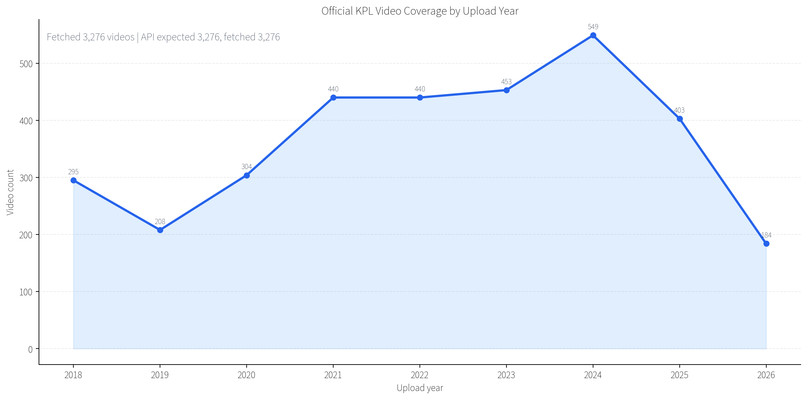

Official video count by title-prefix category:

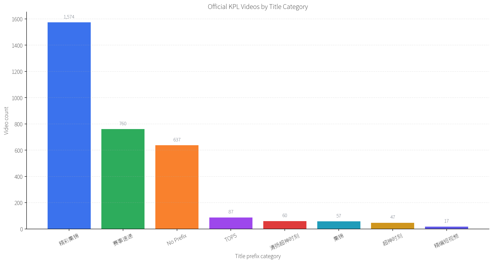

Official video category share:

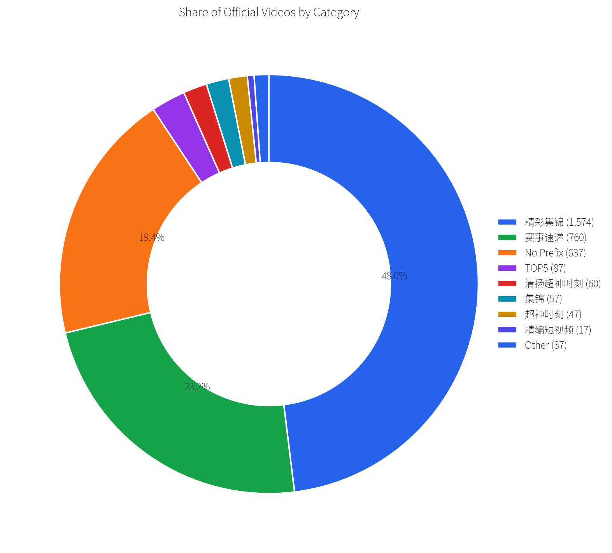

Top-5 title-prefix category duration distribution:

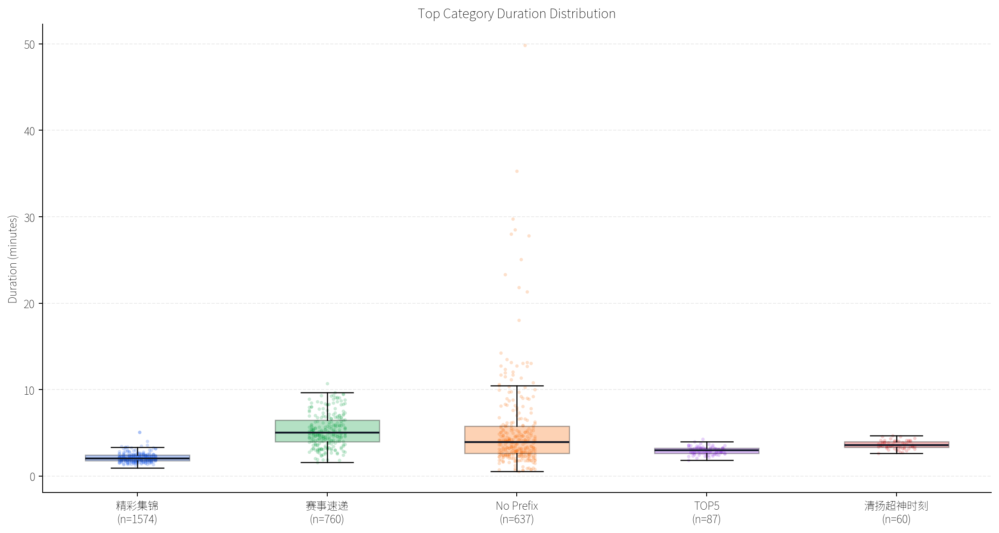

Top-5 title-prefix category play-count distribution:

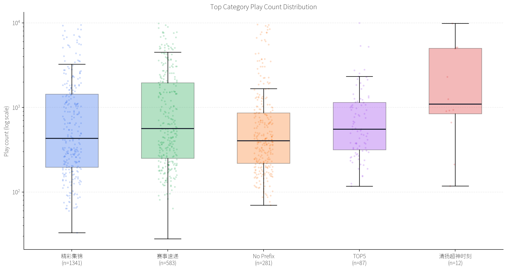

Top-5 title-prefix category yearly video counts:

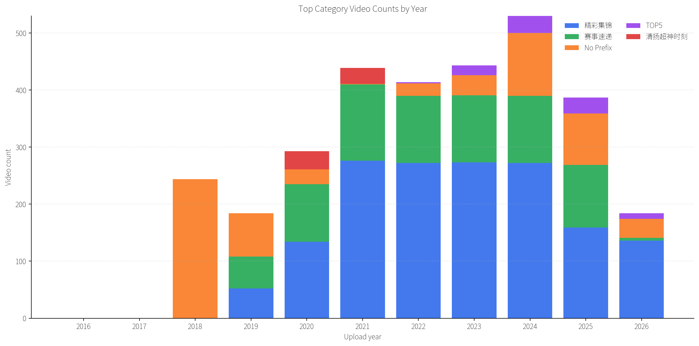

### Stage 10: Highlight Scene Processing

These figures summarize the already-processed top official highlight videos: transition detection, scene splitting, complete/focus segmentation, OCR, and schedule matching.

Highlight processing funnel:

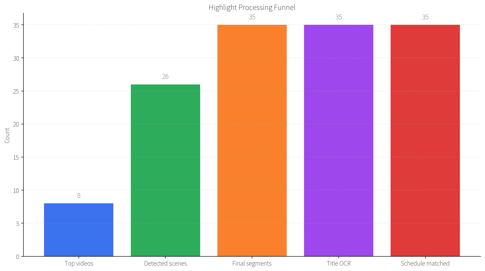

Scene complete/focus classification:

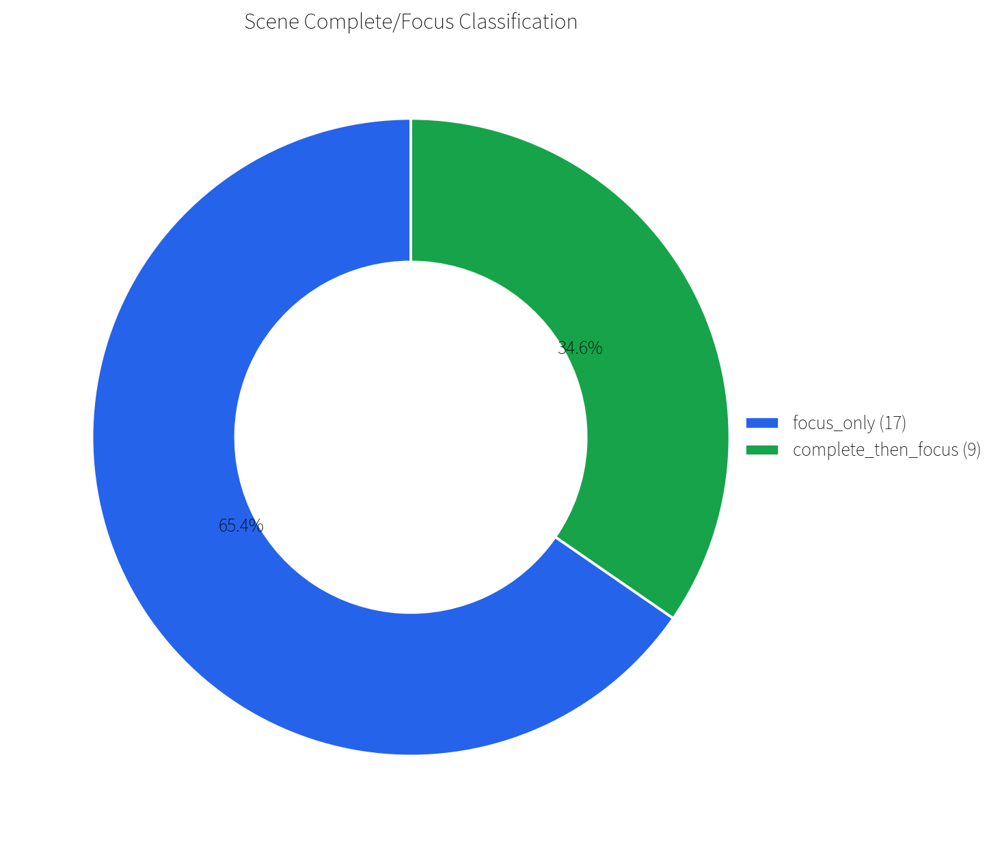

Processed highlight segments by year and kind:

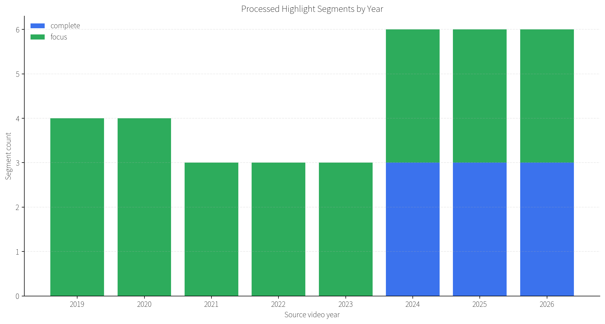

Detected highlight scene duration distribution:

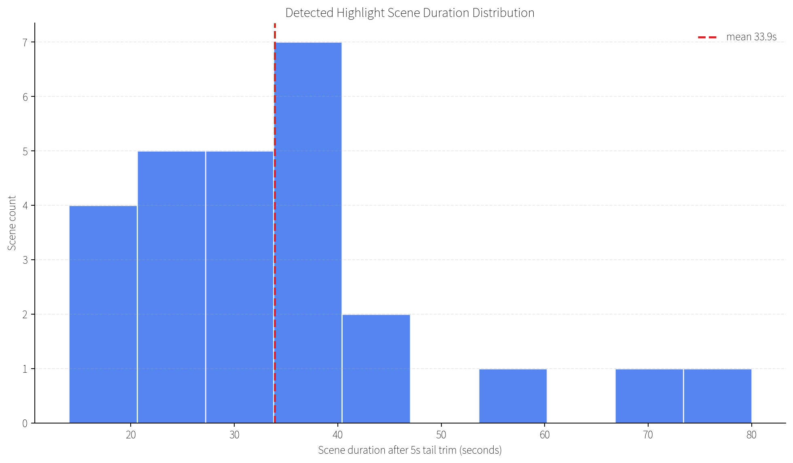

Schedule matching quality:

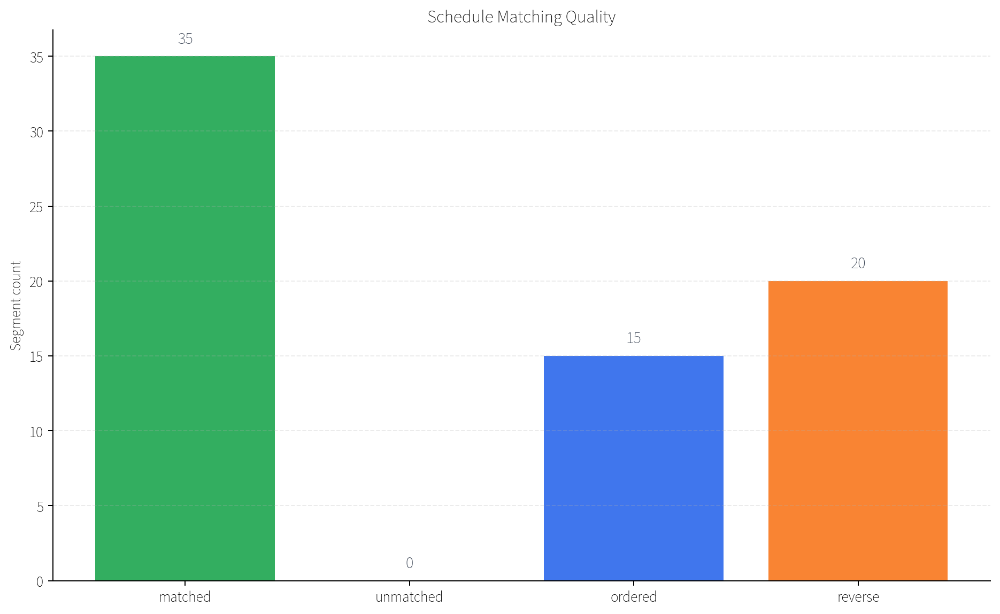

## Full Pipeline

The pipeline script is dry-run by default. It prints every command and writes a command manifest, but does not execute the pipeline unless `--execute` is passed.

```powershell
# Preview the full workflow
python .\run_full_pipeline.py --top-n 3

# Execute the full workflow
python .\run_full_pipeline.py --execute --top-n 3

# Execute and delete large intermediate scene folders after dependent steps finish
python .\run_full_pipeline.py --execute --top-n 3 --cleanup-video-intermediates
```

Primary final outputs:

- `data/pipeline/final_scene_catalog.json`
- `data/pipeline/final_scene_catalog.csv`
- `downloads/pipeline/segments/`

The pipeline stores command metadata at:

- `data/pipeline/pipeline_manifest.json`

## Individual Steps

Fetch official schedules:

```powershell
python .\stage_01_fetch_schedules.py
```

Enrich schedules with match details, round hero picks, and replay links:

```powershell
python .\stage_02_enrich_schedules.py --resume
```

Fetch official video records:

```powershell
python .\stage_03_fetch_videos.py
```

Enrich video records with Tencent detail-page fields:

```powershell
python .\stage_04_enrich_videos.py --resume
```

The schedule and video enrichment scripts both support adaptive parallelism:

```powershell
python .\stage_02_enrich_schedules.py --max-workers 32 --min-workers 4 --resume
python .\stage_04_enrich_videos.py --max-workers 16 --min-workers 2 --resume
```

Analyze and plot video categories:

```powershell
python .\stage_05_analyze_video_stats.py
python .\stage_05_plot_video_stats.py
```

Select top highlight videos and download:

```powershell
python .\stage_06_select_top_highlights.py --top-n 3
python .\stage_06_download_highlights.py --input .\data\top_jingcai_jijin_by_year.json --output-dir .\downloads\pipeline\selected_highlights --max-height 1080 --overwrite
```

Cut scenes, trim tails, split complete/focus segments, OCR, and build the final catalog are orchestrated by `run_full_pipeline.py`.

## Important Scripts

- `run_full_pipeline.py`: end-to-end orchestration, dry-run by default.
- `stage_01_fetch_schedules.py`: official KPL season/stage/team and schedule fetcher.
- `stage_02_enrich_schedules.py`: adaptive parallel detail fetcher for match results, round hero picks, and replay links.
- `stage_03_fetch_videos.py`: official KPL programme/video metadata fetcher.
- `stage_04_enrich_videos.py`: adaptive parallel Tencent detail enrichment.
- `stage_05_analyze_video_stats.py` and `stage_05_plot_video_stats.py`: category stats and plots.
- `stage_06_select_top_highlights.py` and `stage_06_download_highlights.py`: yearly top highlight selection and download.
- `stage_07_split_scenes_by_bw_filter.py`, `stage_07_build_boundary_brightness_template.py`, and `stage_07_trim_scene_tails.py`: black/white transition detection, false-boundary filtering, scene cutting, and tail trimming.
- `stage_08_analyze_complete_focus.py` and `stage_08_split_complete_focus_segments.py`: complete/focus classification and final segment writing.
- `stage_09_extract_title_regions.py` and `stage_09_ocr_scene_titles.py`: title/operator OCR.
- `stage_10_ocr_side_player_teams.py`, `stage_10_match_segments_to_schedules.py`, `stage_10_build_scene_catalog.py`, and `stage_10_plot_highlight_processing.py`: side player-list OCR, schedule matching, final catalog building, and processed-highlight plots.

## Data Policy

Heavy/generated artifacts are not tracked:

- downloaded source videos and cut clips
- full crawled/enriched JSON/CSV outputs
- OCR crops and review images
- checkpoint files
- Python caches

Tracked lightweight outputs:

- selected analysis plots in `docs/assets/plots/`
- selected category statistics in `docs/results/`

This keeps the repository small while still giving the GitHub page a useful preview of the analysis.
